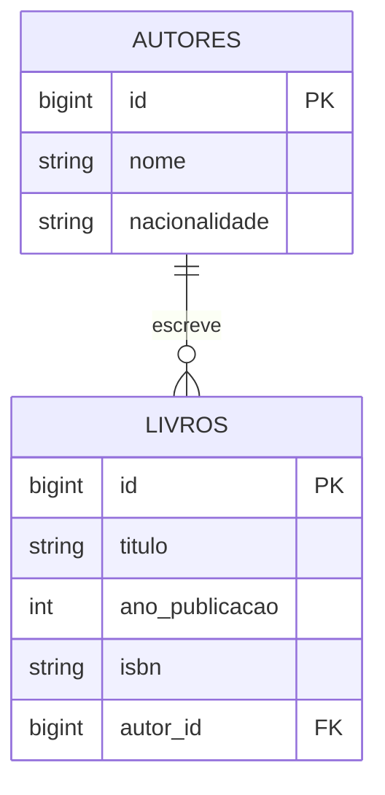

<div align="center" style="text-align: center;">

# Prova Prática LTP3 — CRUD de Biblioteca (Laravel 9 / MVC)


</div>

## Objetivo

Desenvolver um CRUD (Create, Read, Update, Delete) seguindo a arquitetura **MVC** (Model–View–Controller) para uma biblioteca, permitindo cadastrar, listar, editar e excluir **autores** e **livros**. Cada livro pertence a um autor.

A prova é composta por **5 etapas**. Em cada etapa você deve:

1. **Implementar** o que é pedido;
2. **Responder** às questões "Como criar?" e "Como funciona?" no espaço indicado neste README.

> Exemplo de resposta esperada:
> *"A model é criada através do CLI do Laravel executando um comando. Logo a model irá representar a tabela do banco de uma forma abstrata, portanto é importante definir quais são as colunas."*

---

## Sumário

- [0. Preparação do ambiente](#0-preparação-do-ambiente)
- [O que já vem pronto × o que você deve criar](#o-que-já-vem-pronto--o-que-você-deve-criar)
- [Etapa 1 — Models](#etapa-1--models)
- [Etapa 2 — Migrations](#etapa-2--migrations)
- [Etapa 3 — Controllers (com validações)](#etapa-3--controllers-com-validações)
- [Etapa 4 — Rotas](#etapa-4--rotas)
- [Etapa 5 — Formulários de cadastro e edição](#etapa-5--formulários-de-cadastro-e-edição)
- [Checklist de entrega](#checklist-de-entrega)
- [Critérios de avaliação](#critérios-de-avaliação)

---

## 0. Preparação do ambiente

**Pré-requisitos:** PHP 8.0+, Composer e MySQL.

```bash
# 1. Instalar as dependências
composer install

# 2. Criar o arquivo de ambiente
cp .env.example .env        # no Windows (PowerShell): Copy-Item .env.example .env

# 3. Gerar a chave da aplicação
php artisan key:generate
```

4. Crie o banco de dados no MySQL:

```sql
CREATE DATABASE biblioteca CHARACTER SET utf8mb4 COLLATE utf8mb4_unicode_ci;
```

5. Confira as credenciais no `.env`:

```dotenv
DB_CONNECTION=mysql
DB_HOST=127.0.0.1
DB_PORT=3306
DB_DATABASE=biblioteca
DB_USERNAME=root
DB_PASSWORD=
```

6. Suba o servidor e acesse <http://localhost:8000>:

```bash
php artisan serve
```

A página inicial deve abrir mostrando os cards **Autores** e **Livros** com o aviso de que as rotas ainda não foram criadas.

---

## O que já vem pronto × o que você deve criar

### Já vem pronto (não é necessário alterar)

| Arquivo | Descrição |
|---|---|
| `resources/views/layouts/app.blade.php` | Layout base (Tailwind via CDN), menu, mensagens `session('success')` / `session('error')` e `@yield('content')`. |
| `resources/views/welcome.blade.php` | Página inicial. |
| `resources/views/autores/index.blade.php` | Listagem de autores. Espera a variável **`$autores`**. |
| `resources/views/livros/index.blade.php` | Listagem de livros. Espera a variável **`$livros`** (cada livro com o relacionamento **`autor`**). |

As listagens já utilizam os seguintes **nomes de rotas**, portanto suas rotas precisam segui-los:

| Rota | Usada em |
|---|---|
| `autores.index`, `autores.create`, `autores.edit`, `autores.destroy` | Menu e listagem de autores |
| `livros.index`, `livros.create`, `livros.edit`, `livros.destroy` | Menu e listagem de livros |

### Você deve criar

| Etapa | Arquivos |
|---|---|
| 1 | `app/Models/Autor.php`, `app/Models/Livro.php` |
| 2 | `database/migrations/xxxx_create_autores_table.php`, `database/migrations/xxxx_create_livros_table.php` |
| 3 | `app/Http/Controllers/AutorController.php`, `app/Http/Controllers/LivroController.php` |
| 4 | Rotas em `routes/web.php` |
| 5 | `resources/views/autores/create.blade.php`, `resources/views/autores/edit.blade.php`, `resources/views/livros/create.blade.php`, `resources/views/livros/edit.blade.php` |

### Estrutura dos dados

**Autor** (tabela `autores`)

| Coluna | Tipo | Regras |
|---|---|---|
| `id` | bigint (PK) | auto incremento |
| `nome` | string(255) | obrigatório |
| `nacionalidade` | string(100) | obrigatório |
| `created_at` / `updated_at` | timestamp | automático |

**Livro** (tabela `livros`)

| Coluna | Tipo | Regras |
|---|---|---|
| `id` | bigint (PK) | auto incremento |
| `titulo` | string(255) | obrigatório |
| `ano_publicacao` | integer | obrigatório, 4 dígitos |
| `isbn` | string(20) | obrigatório, único |
| `autor_id` | bigint (FK → `autores.id`) | obrigatório, deve existir |
| `created_at` / `updated_at` | timestamp | automático |



---

## Etapa 1 — Models

### Crie as models "Autor" e "Livro"

### Questões

**Q1.1 — Como criar uma model no Laravel?**

> _Resposta:_
As models são criadas quando é digitado o código 'php artisan make:model nome_da_model' no terminal.
>

**Q1.2 — Como funciona uma model? Explique o papel das propriedades `$table` e `$fillable` e dos relacionamentos `hasMany` / `belongsTo`.**

> _Resposta:_
A model é oque faz a conexão entre o PHP e uma tabela do banco de dados.

$table fala para o PHP o nome da tabela.

$fillable indica quais tabelas liberam os campos para salvamento rápido como meio de segurança.

hasMany é usado na model pai para falar que ela tem vários registros relacionados a outra tabela.

belongsTo indica qual o model pai de um registro.

---

## Etapa 2 — Migrations

### Crie as migrations para as tabelas 'autores' e 'livros'

Confira no MySQL se as tabelas `autores` e `livros` foram criadas.

> Dica: se precisar refazer, use `php artisan migrate:fresh` (apaga **todas** as tabelas e recria).

### Questões

**Q2.1 — Como criar uma migration e aplicá-la no banco de dados?**

> _Resposta:_
Uma migration é criada apartir do código 'php artisan make:migration create_nome_table' colocado no terminal. Após criado e editado, pode ser aplicado com 'php artisan migrate'.


**Q2.2 — Como funciona uma migration? Explique os métodos `up()` e `down()`, a importância da ordem de execução e o que faz `foreignId(...)->constrained(...)`.**

> _Resposta:_
As migrations servem como um histórico de alteração do banco de dados por código.

A ordem é muito importante para garantir o funcionamento do código e do banco de dados, sem criar coisas desorganizadas (uma chave estrangeira para uma tabela pai que não existe por exemplo).

up() cria ou altera tabelas quando é rodado 'php artisan serve'.

down() desfaz o que o up() fez quando executa o rollback.

foreignId()->constrained() cria a coluna de ID com o tipo correto e monta a restrição de chave estrangeira apontando pra tabela autores.

---

## Etapa 3 — Controllers (com validações)

### Passo a passo

1. Crie os controllers do tipo *resource* já vinculados às models:

   ```bash
   php artisan make:controller AutorController --resource --model=Autor
   php artisan make:controller LivroController --resource --model=Livro
   ```

2. Implemente os métodos em **`AutorController`**:

   | Método | O que deve fazer |
   |---|---|
   | `index()` | Buscar todos os autores e retornar a view `autores.index` com a variável `$autores`. |
   | `create()` | Retornar a view `autores.create`. |
   | `store(Request $request)` | Validar os dados, criar o autor e redirecionar para `autores.index` com mensagem `success`. |
   | `edit(Autor $autor)` | Retornar a view `autores.edit` com a variável `$autor`. |
   | `update(Request $request, Autor $autor)` | Validar os dados, atualizar o autor e redirecionar com mensagem `success`. |
   | `destroy(Autor $autor)` | Excluir o autor e redirecionar com mensagem `success`. |

   > Os métodos `show()` podem ser removidos (não serão usados).

3. Implemente os métodos em **`LivroController`** seguindo o mesmo padrão, com as diferenças:
   - `index()` deve carregar o autor junto: `Livro::with('autor')->get()`;
   - `create()` e `edit()` devem enviar também a lista de autores (`$autores`) para montar o `<select>` do formulário.

4. **Validações** — utilize `$request->validate([...])` diretamente no controller, dentro de `store()` e `update()`:

   **Autor**

   | Campo | Regras |
   |---|---|
   | `nome` | `required`, `string`, `max:255` |
   | `nacionalidade` | `required`, `string`, `max:100` |

   **Livro**

   | Campo | Regras |
   |---|---|
   | `titulo` | `required`, `string`, `max:255` |
   | `ano_publicacao` | `required`, `integer`, `digits:4` |
   | `isbn` | `required`, `string`, `max:20`, `unique:livros,isbn` (no `update`, ignore o próprio registro: `unique:livros,isbn,` . `$livro->id`) |
   | `autor_id` | `required`, `exists:autores,id` |

   Use o array retornado pelo `validate()` para criar/atualizar o registro (ex.: `Autor::create($dados)`).

5. **(Opcional)** No `destroy()` do autor, impeça a exclusão caso ele possua livros, redirecionando com `with('error', '...')`. Sem isso o banco lançará erro de chave estrangeira.

### Questões

**Q3.1 — Como criar um controller? Qual a diferença de usar as opções `--resource` e `--model`?**

> _Resposta:_
A criação das controllers é feita apartir do código 'php artisan make:controller nome_da_controller' quando digitado no terminal.

--resource cria a classe preenchida com os 7 métodos básicos de um CRUD: index, create, store, show, edit, update e destroy.

--model faz a mesma coisa, mas já coloca a Model nos tipos dos argumentos dos métodos, deixando o código pronto pra usar.

**Q3.2 — Como funciona um controller dentro da arquitetura MVC? Explique a comunicação entre Model, View e Controller e o que é o *Route Model Binding* (ex.: receber `Autor $autor` no método).**

> _Resposta:_
O controller funciona como o mediador entre a model e view.

A Rota recebe a requisição do usuário e chama o Controller. O Controller conversa com a Model para buscar ou salvar dados no banco. O Controller pega essas informações e entrega para a View montar o HTML na tela do usuário.

Route Model Binding é oque o Laravel faz para você não precisar fazer Autor::find($id) manualmente. Ao colocar o parâmetro Autor $autor na função, o Laravel lê o ID direto da URL, busca no banco e entrega o objeto pronto. Se não achar nada, ele já devolve uma página 404 automaticamente.

**Q3.3 — Como funciona o `$request->validate()`? O que acontece quando a validação falha e quando ela passa?**

> _Resposta:_
O '$request->validate()' confere se os dados enviados no formulário seguem as regras que você definiu. Se passar: O código continua normalmente pra próxima linha do controller.

Caso der erro, tudo para. Em páginas web, o Laravel manda o usuário de volta pro formulário, trazendo os avisos de erro e mantendo o que ele já tinha digitado. Se for uma API, ele devolve uma resposta JSON com status 422 Unprocessable Entity.

---

## Etapa 4 — Rotas

### Passo a passo

1. Em `routes/web.php`, importe os controllers:

   ```php
   use App\Http\Controllers\AutorController;
   use App\Http\Controllers\LivroController;
   ```

2. Registre as rotas de recurso:
   - `Route::resource('autores', AutorController::class)->parameters(['autores' => 'autor']);`
     > ⚠️ Sem o `parameters()`, o Laravel geraria o parâmetro `{autore}` (singular em inglês) e o *Route Model Binding* com `Autor $autor` não funcionaria.
   - `Route::resource('livros', LivroController::class);`
   - (Opcional) use `->except(['show'])` em ambas.

3. Liste as rotas criadas e confira os nomes (`autores.index`, `autores.create`, ...):

   ```bash
   php artisan route:list
   ```

4. Acesse <http://localhost:8000/autores> e <http://localhost:8000/livros>. As listagens devem abrir (vazias) e o menu superior deve exibir os links.

### Questões

**Q4.1 — Como criar as rotas de um CRUD no Laravel? Quais rotas o `Route::resource` gera (método HTTP, URI, ação e nome)?**

> _Resposta:_
Você cria todas as rotas do CRUD de uma só vez usando 'Route::resource('autores', AutorController::class);'

Listagem: GET /autores $\rightarrow$ Método index $\rightarrow$ Nome autores.index
Formulário de criação: GET /autores/create $\rightarrow$ Método create $\rightarrow$ Nome autores.create
Salvar no banco: POST /autores $\rightarrow$ Método store $\rightarrow$ Nome autores.store
Exibir um item: GET /autores/{autor} $\rightarrow$ Método show $\rightarrow$ Nome autores.show
Formulário de edição: GET /autores/{autor}/edit $\rightarrow$ Método edit $\rightarrow$ Nome autores.edit
Atualizar no banco: PUT/PATCH /autores/{autor} $\rightarrow$ Método update $\rightarrow$ Nome autores.update
Deletar do banco: DELETE /autores/{autor} $\rightarrow$ Método destroy $\rightarrow$ Nome autores.destroy

**Q4.2 — Como funciona o sistema de rotas? Explique o caminho de uma requisição desde a URL até o controller e a utilidade das rotas nomeadas (`route('autores.index')`).**

> _Resposta:_
Ao digitar uma URL no navegador, as routes capturam esse acesso, conferem o método e descobrem qual Controller vai receber aquele pedido.

As 'Rotas Nomeadas' funcionam como apelidos pras suas URLs. Ao usar route('autores.index') no código, você gera o link de forma dinâmica.

---

## Etapa 5 — Formulários de cadastro e edição

### Passo a passo

Crie as quatro views abaixo. Todas devem estender o layout base com `@extends('layouts.app')` e colocar o conteúdo em `@section('content')`.

1. **`resources/views/autores/create.blade.php`**
   - `<form>` com `method="POST"` e `action="{{ route('autores.store') }}"`;
   - `@csrf`;
   - Campos `nome` e `nacionalidade` com `value="{{ old('nome') }}"`;
   - Exibição de erros de cada campo com `@error('campo') ... @enderror`;
   - Botão salvar e link para voltar à listagem.

2. **`resources/views/autores/edit.blade.php`**
   - Mesmo formulário, com `action="{{ route('autores.update', $autor) }}"`;
   - `@csrf` **e** `@method('PUT')`;
   - Campos preenchidos com `old('nome', $autor->nome)`.

3. **`resources/views/livros/create.blade.php`**
   - Campos `titulo`, `ano_publicacao`, `isbn`;
   - `<select name="autor_id">` percorrendo `$autores` com `@foreach`, mantendo a opção selecionada com `old('autor_id')`.

4. **`resources/views/livros/edit.blade.php`**
   - Mesmo formulário com `@method('PUT')` e valores do `$livro`;
   - No `<select>`, marque como `selected` o autor atual (`old('autor_id', $livro->autor_id)`).

5. Teste o fluxo completo:
   - Cadastrar, editar e excluir um autor;
   - Cadastrar, editar e excluir um livro;
   - Enviar formulários vazios/inválidos e verificar se as mensagens de erro aparecem e os valores digitados são mantidos.

> Dica: o layout usa Tailwind CSS. Você pode seguir o estilo das listagens, por exemplo: `class="w-full rounded border px-3 py-2"` para inputs.

### Questões

**Q5.1 — Como criar um formulário Blade para cadastro e para edição? Por que o formulário de edição precisa de `@method('PUT')` e para que serve o `@csrf`?**

> _Resposta:_
O formulário de cadastro
<form action="{{ route('autores.store') }}" method="POST">
    @csrf
    <button type="submit">Salvar</button>
</form>

O formulário de edição
<form action="{{ route('autores.update', $autor->id) }}" method="POST">
    @csrf
    @method('PUT')
    <button type="submit">Atualizar</button>
</form>

A @csrf gera um token invisível de segurança. Sem ele, o Laravel bloqueia o envio do formulário pra evitar ataques maliciosos vindos de fora.

O @method('PUT') adiciona um campo escondido avisando o Laravel pra tratar esse envio como um PUT pra poder atualizar os dados.


**Q5.2 — Como funciona a exibição dos erros de validação e a manutenção dos dados digitados? Explique `$errors`, `@error` e `old()`.**

> _Resposta:_
O Laravel salva os erros e os dados antigos pra você usar no Blade quando o formulário falha na validação.

$errors é uma variável que já chega pronta no Blade contendo a lista com todas as mensagens de erro que aconteceram.

@error('campo') é um bloco prático para checar se um campo específico falhou. Se falhar, ele exibe a mensagem correspondente na variável $message
@error('nome')
<p style="color: red;">{{ $message }}</p>
@enderror

old('campo') recupera o texto que o usuário tinha digitado antes do erro acontecer. Colocando isso no atributo value do inpurt
<input type="text" name="nome" value="{{ old('nome', $autor->nome ?? '') }}">


---

## Checklist de entrega

- [x] Models `Autor` e `Livro` com `$fillable` e relacionamentos
- [x] Migrations de `autores` e `livros` executadas com chave estrangeira
- [x] `AutorController` e `LivroController` com `index`, `create`, `store`, `edit`, `update`, `destroy`
- [x] Validações com `$request->validate()` em `store` e `update`
- [x] Rotas `resource` registradas e nomeadas corretamente
- [x] Views `create` e `edit` de autores e livros
- [x] Mensagens de erro e de sucesso exibidas
- [x] Todas as questões (Q1.1 a Q5.2) respondidas neste README


## Licença

Distribuído sob a licença MIT. Veja [LICENSE](LICENSE).
